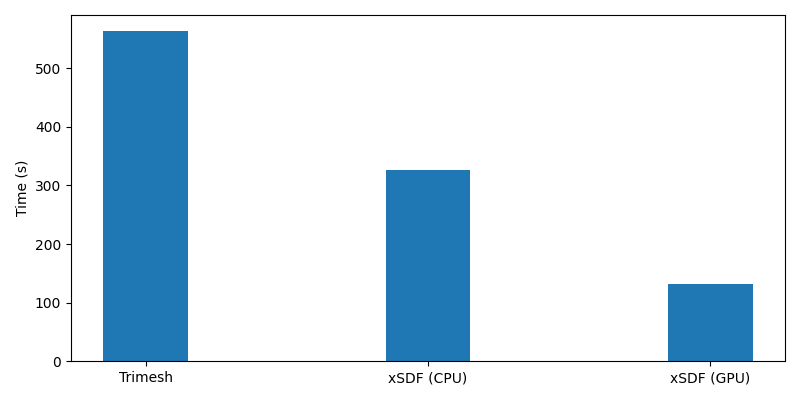
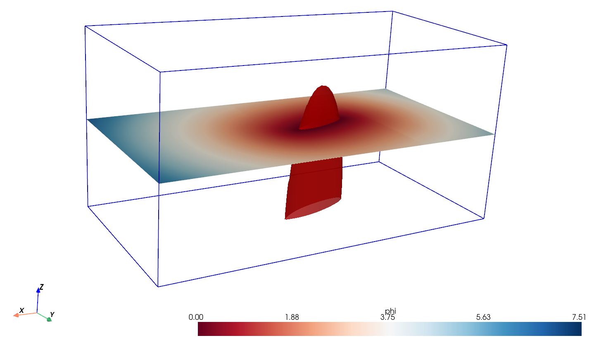

# xSDF 

Fast generation of Signed Distance Fields (SDF) for combined geometrical meshes and domains, specifically for boundary immersion method, computational fluid dynamics (CFD) on cartesian grids & geometric deep learning (GDL) applications, using graph neural network architectures.

SDF computation is implemented in `PyTorch` for GPU acceleration. For large domains, uniform grids often require excessive resolution in far-field regions where it's unnecessary. To address this, the tool supports non-uniform grid generation through geometric stretching, concentrating resolution near geometry interfaces while maintaining coarser far-field spacing.

### Features:

- GPU accleration using PyTorch tensors (Apple M-series GPU support via MPS backend)
- Axis-Aligned Bounding Box (AABB) fast overlap checking & triangle pruning 
- Solid-Angle method (winding number) signing
- Automatic & adaptive memory managment to avoid RAM overflow
- Support for uniform & non-uniform (center-point & piecewise multi-segment) grid generation
- lightwieght HDF5 file output (.h5)

#### Speed & Performance:

A speed performance comparison is given below for 128k grid points on an Apple M4 (CPU/GPU 10/10-core) macbook running either trimesh or xSDF torch backend.

<p align="center">

</p>

xSDF performance is ~5x faster on GPU than trimesh. For large-scale meshes, the speed-up is expected to be significant when offloading to a CUDA supported GPU. (Some comparison figures to be added -TBA) 

### Basic Usage:

1. **Configure** case in `sdf_config.json`
2. **Run** the generator:

```bash
python xSDF.py                    # Use sdf_config.json
python xSDF.py my_config.json     # Use a custom config
```

#### Quickstart: SDF from STL (Ahmed body)

The repo includes a ready-to-run Ahmed body example. Generate an SDF from `examples/ahmed_1.stl` with one command:

```bash
python xSDF.py examples/sdf_config_ahmed_piecewise.json
```

This loads the STL, builds a geometrically-stretched grid clustered around the body, previews the grid (close the window to proceed), and writes the SDF to an HDF5 file.

The config (`examples/sdf_config_ahmed_piecewise.json`) is the simplest way to get started: edit the domain bounds, the STL path, and the stretch parameters to fit your geometry.

<p align="center">

</p>

<p align="center">

</p>

### Configuration Reference Docs

A full xSDF config file is a JSON document with five top-level sections: `output`, `domain`, `geometry`, `grid`, and `backend`. The Ahmed body example (`examples/sdf_config_ahmed_piecewise.json`) is annotated below as a reference.

#### `output`

```json
"output": {
  "save_name": "AHMED_PWGrid_CS002-STRCH105.h5",
  "visualize": true
}
```

| Field        | Description |
|--------------|-------------|
| `save_name`  | HDF5 file written by xSDF. Contains `levelset`, `x_coords`, `y_coords`, `z_coords`, `origin`, `grid_size`, and a `non_uniform_grid` attribute. |
| `visualize`  | If `true`, post-run plotting routines are called on the saved H5 (slices through the SDF, isosurface, etc.). Set `false` for headless/batch runs. |

#### `domain`

```json
"domain": {
  "bounds": {
    "x": [-2.0, 2.5],
    "y": [-1.0, 1.0],
    "z": [ 0.0, 1.0]
  }
}
```

The domain block defines the cartesian bounding box that the SDF will be evaluated over. Bounds are in the same length units as the STL geometry. The first/last face position on each axis is snapped to these exact bounds, regardless of the stretching method.

#### `geometry`

```json
"geometry": {
  "type": "stl",
  "path": "examples/ahmed_1.stl",
  "transformations": {
    "scale": 1.0,
    "translate": [0.0, 0.0, 0.0],
    "rotate":    [0.0, 0.0, 0.0]
  }
}
```

| Field    | Description |
|----------|-------------|
| `type`   | `"stl"` to load a mesh from disk, or `"cube"` / `"cylinder"` to use a built-in primitive (handy for sanity checks without an STL). |
| `path`   | Path to the mesh file (`.stl`, `.ply`, etc.) — only used when `type = "stl"`. |
| `transformations.scale`     | Uniform scale factor applied to the mesh vertices before placement. Use this to convert mm → m (e.g. `0.001`) or to upscale a unit-cube STL. |
| `transformations.translate` | `[tx, ty, tz]` offset applied **after scaling**. Use this to position the geometry within the `domain.bounds` block. |
| `transformations.rotate`    | `[rx, ry, rz]` Euler rotation angles in **degrees**, applied via `trimesh.transformations.euler_matrix`. Use this to set angle of attack, sideslip, or yaw. |

The transformation order is: **scale → rotate → translate**. After loading and transforming the mesh, xSDF reports the resulting bounds and watertightness, and (if needed) attempts a normal/winding repair so the SDF sign is reliable.

#### `grid`

```json
"grid": {
  "target_min_size": 0.02,
  "stretch_factor":  1.05,
  "stretch_axes": { "x": { ... }, "y": { ... }, "z": { ... } },
  "preview_stretch": true
}
```

| Field             | Description |
|-------------------|-------------|
| `target_min_size` | Default fine cell size. Used as `dx_min` (center-point) or `dx_target` (piecewise) when an axis leaves it `null` / unspecified. |
| `stretch_factor`  | Default geometric growth ratio. Used as `r_max` (center-point) or `r_target` (piecewise) when not overridden per-axis. |
| `preview_stretch` | If `true`, a matplotlib window pops up showing the 1D coordinate distributions and a 3D scatter of the face-vertex grid with the geometry overlaid. **Close the window to proceed**, or cancel to abort the run before the SDF computation. |

`stretch_axes` holds a per-axis sub-block (`x`, `y`, `z`). Two stretching modes are supported:

**Center-point (single geometric stretch):**

```json
"x": { "center": 0.0, "dx_min": null, "r_max": 1.025 }
```

| Field    | Description |
|----------|-------------|
| `center` | Focus point where spacing is finest. |
| `dx_min` | Smallest cell size at `center` (inherits `target_min_size` if `null`). |
| `r_max`  | Geometric growth ratio outward from `center` (inherits `stretch_factor` if `null`; set to `1.0` for a uniform axis). |

**Piecewise (multi-segment):**

```json
"x": {
  "type": "piecewise",
  "segments": [
    {"type": "DECREASING", "lower_bound": -2.0,  "upper_bound": -1.25},
    {"type": "CONSTANT",   "lower_bound": -1.25, "upper_bound":  0.5 },
    {"type": "INCREASING", "lower_bound":  0.5,  "upper_bound":  2.5 }
  ]
}
```

The `segments` list is ordered lower-to-upper along the axis. Each entry has a `type` (`CONSTANT`, `INCREASING`, or `DECREASING`) and `[lower_bound, upper_bound]`. `dx_target` and `r_target` inherit from `target_min_size` and `stretch_factor` unless overridden in the sub-block.

#### `backend`

```json
"backend": {
  "method": "torch",
  "memory_budget_gb": 8.0,
  "torch": {
    "device": "mps",
    "use_accel": true,
    "compile_kernels": false
  }
}
```

| Field                 | Description |
|-----------------------|-------------|
| `method`              | `"torch"` for the GPU-accelerated backend (recommended), or `"trimesh"` for the CPU fallback. |
| `memory_budget_gb`    | Soft cap on peak working memory incase you want to use lower than max. available. Both backends use this to chunk the grid and stay under the limit; lower it if you hit OOM. |
| `torch.device`        | `"cuda"`, `"mps"` (Apple silicon), or `"cpu"`. |
| `torch.use_accel`     | Enables the AABB triangle pruning + winding-number signing accelerator path. |
| `torch.compile_kernels` | Wraps the inner kernels in `torch.compile` for an extra speedup. Adds JIT warmup time on the first run. |


## Examples of different grids

See `/examples` for various config. examples using the different grid types.

### Uniform Grid

<p align="center">

</p>

### Non-Uniform Grid, Center-Point Stretching
<p align="center">

</p>

### Non-Uniform Grid, Piecewise Stretching
<p align="center">

</p>

## Final Note

Hopefully this code may be useful to someone, any bugs or issues, just let me know!

## To Dos, features, etc.
- Speed tests on NVIDIA hardware and `torch.compile()`
- Implement Bounding Volume Hierchary (BVH) as optional accel method (or default depending on speed-up)


## References

- **Solid Angle Method**: Van Oosterom & Strackee, "The Solid Angle of a Plane Triangle" (1983)
- **Point-Triangle Distance (AABB)**: Ericson. C, "Real-Time Collision Detection" (2004)


<!-- 
----

#### Example with Uniform Grid:

An elliptical foil test case is used as a base example on a uniform grid. The ellptical foil section is imported as a .stl file and handled as a trimesh mesh object. For a CFD case setup, xSDF supports creation of a block domain and translation/rotation of imported geometries within the specified domain. The test case here is shown on a 80x40x40 grid with 128k voxels of uniform spacing.

Once the case is setup and executed, the geometry and grid will be previewed to confirm whether all is as expected, before proceeding with the SDF computation.


The final output SDF is given as a .HDF5 file.


## Example with Non-Uniform Grid, Center-Point Stretching

With grid stretching on the same case:


<!-- with final SDF evaluation given as, -->

<!--  -->

<!-- 
### Example with Non-Uniform Grid, Piecewise Stretching

For external flow cases like the Ahmed body, a center-point geometric stretch wastes resolution. xSDF supports **piecewise multi-segment stretching** where each axis can mix uniform fine-spacing regions (`CONSTANT`) with geometric coarsening toward the boundaries (`INCREASING`/`DECREASING`).

Run the Ahmed body case with piecewise stretching:

```bash
python xSDF.py examples/sdf_config_ahmed_piecewise.json
```

The config (`examples/sdf_config_ahmed_piecewise.json`) defines per-axis segments:


Hopefully this code may be useful to someone, any bugs or issues, just let me know!

## To Dos, features, etc.
- Speed tests on NVIDIA hardware and `torch.compile()`
- Implement Bounding Volume Hierchary (BVH) as optional accel method (or default depending on speed-up)


## References

- **Solid Angle Method**: Van Oosterom & Strackee, "The Solid Angle of a Plane Triangle" (1983)
- **Point-Triangle Distance (AABB)**: Ericson. C, "Real-Time Collision Detection" (2004) -->


