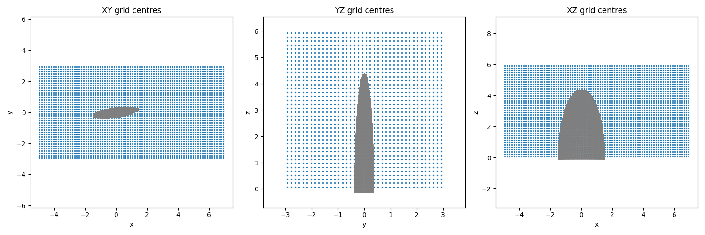
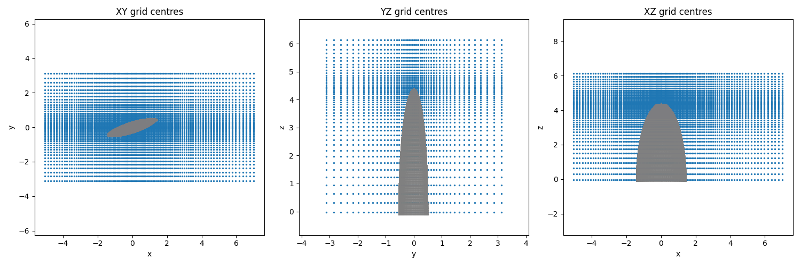

# xSDF 

Fast generation of Signed Distance Fields (SDF) for combined geometrical meshes and domains, specifically for boundary immersion method computational fluid dynamics (CFD) on cartesian grids.

SDF computation is implemented in PyTorch for GPU acceleration. Apple M-series GPU support via MPS backend. For large domains, uniform grids often require excessive resolution in far-field regions where it's unnecessary. To address this, the tool supports non-uniform grid generation through geometric stretching, concentrating resolution near geometry interfaces while maintaining coarser far-field spacing.

### Features:

- GPU accleration using PyTorch tensors
- Axis-Aligned Bounding Box (AABB) fast overlap checking & triangle pruning 
- Solid-Angle Method (Winding Number) signing
- Automatic & adaptive memory managment to avoid RAM overflow
- Support for uniform & non-uniform grid generation
- HDF5 file output

### Basic Usage:

1. **Configure** case in `sdf_config.json`
2. **Run** the generator:

```bash
python xSDF.py                    # Use sdf_config.json
python xSDF.py my_config.json     # Use a custom config
```

#### Example with Uniform Grid:

An elliptical foil test case is used as a base example on a uniform grid. The ellptical foil section is imported as a .stl file and handled as a trimesh mesh object. For a CFD case setup, xSDF supports creation of a block domain and translation/rotation of imported geometries within the specified domain. The test case here is shown on a 80x40x40 grid with 128k voxels of uniform spacing.

Once the case is setup and executed, the geometry and grid will be previewed to confirm whether all is as expected, before proceeding with the SDF computation.



The final output SDF is given as a .HDF5 file.

#### Speed & Performance:

A speed performance comparison is given below on an Apple M4 (10-core CPU, 10-core GPU, 32GB RAM) macbook running either trimesh or xSDF backend.


xSDF performance is ~5x faster on GPU than trimesh. For large-scale meshes, the speed-up is expected to be significant when offloading to a CUDA supported GPU. (Some comparison figures to be added -TBA) 

#### Example with Grid Stretching

With grid stretching on the same case:



with final SDF evaluation given as,


Hopefully this code may be useful to someone, any bugs or issues, just let me know!

## To Dos, features, etc.
- Test on larger scale mesh with stretching (>5M points).
- Implement Bounding Volume Hierchary (BVH) as optional accel method (or default depending on speed-up)


## References

- **Solid Angle Method**: Van Oosterom & Strackee, "The Solid Angle of a Plane Triangle" (1983)
- **Point-Triangle Distance (AABB)**: Ericson. C, "Real-Time Collision Detection" (2004)

