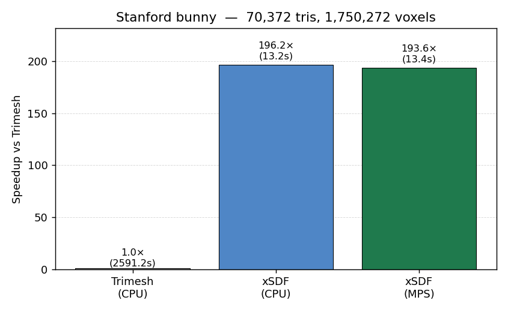
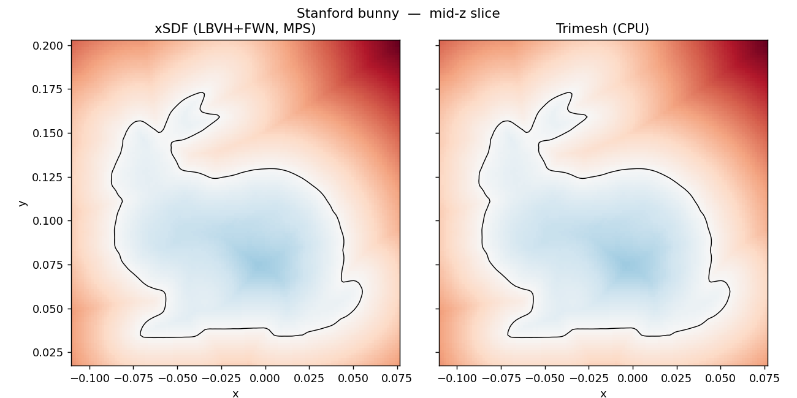
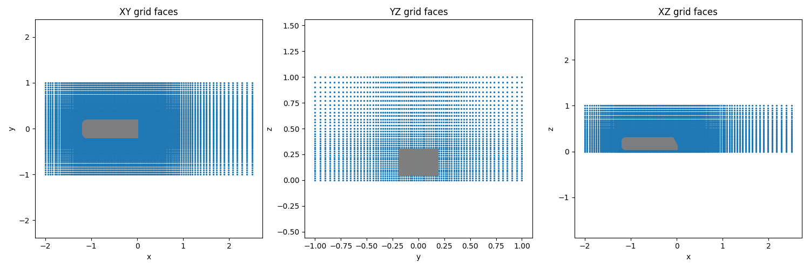
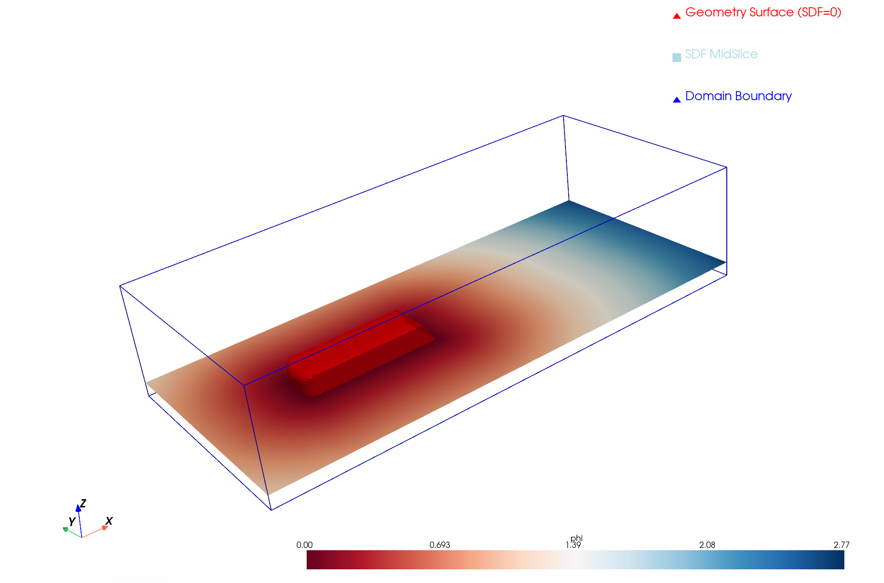
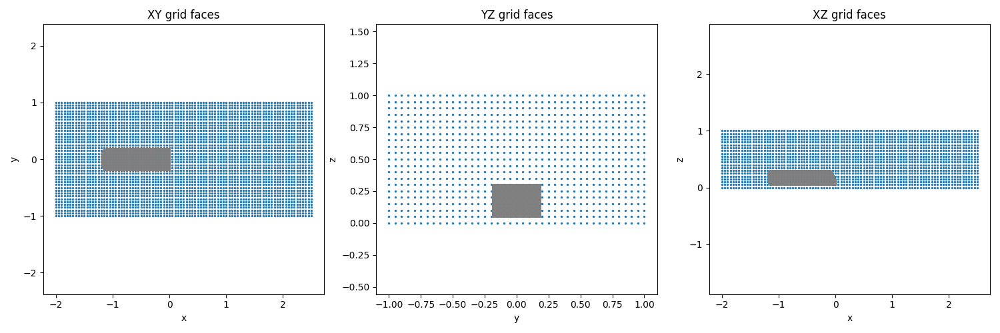
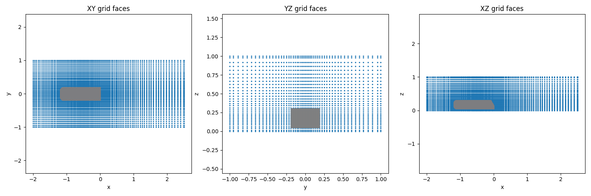

# xSDF

Fast generation of Signed Distance Functions (SDF) for combined geometrical meshes and domains, specifically for boundary immersion methods, computational fluid dynamics (CFD) on cartesian grids, but also for geometric deep learning (GDL) applications using graph neural network architectures.

The SDF computation runs on PyTorch and is device-agnostic (CUDA / Apple MPS / CPU). For large domains, uniform grids often waste resolution in far-field regions. xSDF supports non-uniform grid generation via geometric stretching, concentrating cells near the geometry while keeping the far-field coarse.

### Features

xSDF is very fast. It's fully vectorized and use a mix of various accelerated methods for both query and signing. This code features:

- **GPU acceleration** via PyTorch (CUDA, Apple MPS, or CPU).
- **Linear Bounding Volume Hierarchy (LBVH)** device-parallel BVH with Morton-sort + longest-common-prefix construction, built on `device` (Karras et al., 2018).
- **Greedy-leaf warm-start + batched-BFS LBVH traversal** for exact unsigned distance. Kernel launches scale with tree depth, not per-query path length. Chunked for memory safety.
- **Hierarchical Fast Winding Number (FWN)** for fast sign assignment (Barill et al.,2018) .
- **Gradient-consistent flood fill**, FWN pass only runs where needed (around geom. + narrow band) and not on the entire grid (large domain accelerator).
- **Geometric grid stretching**: uniform, center-point single-stretch, or piecewise multi-segment per-axis.
- **HDF5 output** (`.h5`) with grid metadata (`levelset`, `x/y/z_coords`, `origin`, `grid_size`, `non_uniform_grid`).

#### Speed & Performance

Result on the Stanford bunny (1.75 M voxels, 70 k triangles, `Apple M4`):

| Backend            | Wall time | Speedup (vs Trimesh) |
|--------------------|----------:|-------------------:|
| Trimesh (CPU)      |  2591.2 s |               1.0× |
| **xSDF (MPS)**       | **13.4 s**|         **194 ×**  |
| **xSDF (CPU)**       | **13.2 s**|         **196 ×**  |

100% sign agreement against Trimesh. Note: MPS is slightly slower than CPU due to BFS per-launch dispatch overhead (torch.compile not available on MPS to fuse).

<p align="center">

</p>

SDF accuracy evaluation on the bunny showing a mid-plane slice (z=0)

<p align="center">

</p>


### Basic Usage

1. **Configure** a case in `sdf_config.json` (or copy one from `examples/`).
2. **Run** the generator:

```bash
python xSDF.py                              # use sdf_config.json
python xSDF.py my_config.json               # use a custom config
python xSDF.py examples/sdf_config_bunny.json
```

#### Quickstart: SDF from STL (Ahmed body)

The repo ships a ready-to-run Ahmed body example. Generate an SDF from `examples/ahmed_1.stl` with one command:

```bash
python xSDF.py examples/sdf_config_ahmed_piecewise.json
```

This loads the STL, builds a piecewise-stretched grid clustered around the body, previews the grid (close the window to proceed), and writes the SDF to an HDF5 file.

The config (`examples/sdf_config_ahmed_piecewise.json`) is the simplest way to get started: edit the domain bounds, the STL path, and the stretch parameters to fit your geometry. You will be prompted with a visual of the geometry in the defined domain:

<p align="center">

</p>

After computation, the complete SDF is shown visually: 

<p align="center">

</p>

### Configuration Reference

A full xSDF config is a JSON document with five top-level sections: `output`, `domain`, `geometry`, `grid`, and `backend`. The Ahmed body example (`examples/sdf_config_ahmed_piecewise.json`) is annotated below as a reference.

#### `output`

```json
"output": {
  "save_name": "AHMED_PWGrid_CS002-STRCH105.h5",
  "visualize": true
}
```

| Field        | Description |
|--------------|-------------|
| `save_name`  | HDF5 file written by xSDF. Contains `levelset`, `x_coords`, `y_coords`, `z_coords`, `origin`, `grid_size`, and a `non_uniform_grid` attribute. |
| `visualize`  | If `true`, post-run plotting routines are called on the saved H5 (slices through the SDF, isosurface, etc.). Set `false` for headless / batch runs. |

#### `domain`

```json
"domain": {
  "bounds": {
    "x": [-2.0, 2.5],
    "y": [-1.0, 1.0],
    "z": [ 0.0, 1.0]
  }
}
```

The domain block defines the cartesian bounding box that the SDF will be evaluated over. Bounds are in the same length units as the geometry. The first/last face position on each axis is snapped to these exact bounds, regardless of the stretching method.

#### `geometry`

```json
"geometry": {
  "type": "stl",
  "path": "examples/ahmed_1.stl",
  "transformations": {
    "scale": 1.0,
    "translate": [0.0, 0.0, 0.0],
    "rotate":    [0.0, 0.0, 0.0]
  }
}
```

| Field    | Description |
|----------|-------------|
| `type`   | `"stl"` to load a mesh from disk (handles `.stl`, `.ply`, `.obj`, etc. via `trimesh.load`), or `"cube"` / `"cylinder"` for a built-in primitive (handy for sanity checks without an STL). |
| `path`   | Path to the mesh file — only used when `type = "stl"`. |
| `transformations.scale`     | Uniform scale factor applied to the mesh vertices before placement. Use this to convert mm → m (e.g. `0.001`) or to upscale a unit-cube STL. |
| `transformations.translate` | `[tx, ty, tz]` offset applied **after scaling**. Use this to position the geometry within the `domain.bounds` block. |
| `transformations.rotate`    | `[rx, ry, rz]` Euler rotation angles in **degrees**, applied via `trimesh.transformations.euler_matrix`. Use this to set angle of attack, sideslip, or yaw. |

The transformation order is: **scale → rotate → translate**. After loading and transforming the mesh, xSDF reports the resulting bounds and watertightness. xSDF does **not** auto-run `pymeshfix`; if your mesh has large open holes (e.g. the raw Stanford bunny scan), pre-repair it — see how `tests/bench_stanford.load_and_repair` does this. FWN signs non-watertight meshes gracefully, but the gradient flood fill can leak through large holes if the gradient field on either side of the hole is consistent.

#### `grid`

```json
"grid": {
  "target_min_size": 0.02,
  "stretch_factor":  1.05,
  "stretch_axes": { "x": { ... }, "y": { ... }, "z": { ... } },
  "preview_stretch": true
}
```

| Field             | Description |
|-------------------|-------------|
| `target_min_size` | Default fine cell size. Used as `dx_min` (center-point) or `dx_target` (piecewise) when an axis leaves it `null` / unspecified. |
| `stretch_factor`  | Default geometric growth ratio. Used as `r_max` (center-point) or `r_target` (piecewise) when not overridden per-axis. |
| `preview_stretch` | If `true`, a matplotlib window pops up showing the 1D coordinate distributions and a 3D scatter of the face-vertex grid with the geometry overlaid. **Close the window to proceed**, or cancel to abort the run before SDF computation. |

`stretch_axes` holds a per-axis sub-block (`x`, `y`, `z`). Two stretching modes are supported:

**Center-point (single geometric stretch):**

```json
"x": { "center": 0.0, "dx_min": null, "r_max": 1.025 }
```

| Field    | Description |
|----------|-------------|
| `center` | Focus point where spacing is finest. |
| `dx_min` | Smallest cell size at `center` (inherits `target_min_size` if `null`). |
| `r_max`  | Geometric growth ratio outward from `center` (inherits `stretch_factor` if `null`; set to `1.0` for a uniform axis). |

**Piecewise (multi-segment):**

```json
"x": {
  "type": "piecewise",
  "segments": [
    {"type": "DECREASING", "lower_bound": -2.0,  "upper_bound": -1.25},
    {"type": "CONSTANT",   "lower_bound": -1.25, "upper_bound":  0.5 },
    {"type": "INCREASING", "lower_bound":  0.5,  "upper_bound":  2.5 }
  ]
}
```

The `segments` list is ordered lower-to-upper along the axis. Each entry has a `type` (`CONSTANT`, `INCREASING`, or `DECREASING`) and `[lower_bound, upper_bound]`. `dx_target` and `r_target` inherit from `target_min_size` and `stretch_factor` unless overridden in the sub-block. See [`docs/stretching_methods.md`](docs/stretching_methods.md) for the full reference.

#### `backend`

```json
"backend": {
  "method": "torch",
  "memory_budget_gb": 8.0,
  "torch": {
    "device": "mps",
    "fwn_beta": 2.0,
    "fwn_band_width_cells": 3.0,
    "cos_theta_min": 0.8
  }
}
```

| Field                      | Description |
|----------------------------|-------------|
| `method`                   | `"torch"` for the LBVH+FWN GPU backend (default), or `"trimesh"` for fallback and testing. |
| `memory_budget_gb`         | Memory budget consumed by the **trimesh** backend only (controls its grid chunk size). The torch backend uses a fixed empirical MPS-safe chunk threshold internally and ignores this field. |
| `torch.device`             | `"cuda"`, `"mps"` (Apple silicon), or `"cpu"`. |
| `torch.fwn_beta`           | Barill dipole admissibility ratio (default `2.0` — ~4 digits FWN accuracy). Raise to `3.0+` if sign is wrong near thin features. |
| `torch.fwn_band_width_cells` | Width of the narrow band around the surface, in cells (default `3.0`). Voxels inside this band always get exact FWN signing; outside it, the gradient flood fill runs first and FWN only revisits conflicts and unresolved voxels. |
| `torch.cos_theta_min`      | Gradient-alignment threshold for flood-fill voting (default `0.8`). Higher = more conservative propagation; lower = more aggressive. |

A standalone FWN-tuning example: `examples/sdf_config_ahmed_fwn.json`.


## Examples of different grids

See `/examples` for various config examples using the Ahmed body case for the different grid types.

### Uniform Grid

<p align="center">

</p>

### Non-Uniform Grid, Center-Point Stretching
<p align="center">

</p>

### Non-Uniform Grid, Piecewise Stretching
<p align="center">

</p>


## Final Note

Hopefully this code may be useful — bugs and issues, just let me know!

## To Dos
- Speed tests on CUDA. 
- Gradient exposure.
- Surface Area Heuristic (SAH), fix for MPS dispatch overhead as LBVH -> LHBVH?


## References

- **LBVH**: Karras, "Maximizing Parallelism in the Construction of BVHs, Octrees, and k-d Trees", High Performance Graphics (2012)
- **Fast Winding Number (FWN)**: Barill, Dickson, Schmidt, Levin, Jacobson, "Fast Winding Numbers for Soups and Clouds", SIGGRAPH (2018)
- **Solid Angle Signing (on FWN leaf evaluation)**: Van Oosterom & Strackee, "The Solid Angle of a Plane Triangle" (1983)
- **Point-Triangle Distance (AABB)**: Ericson. C, "Real-Time Collision Detection" (2004)
